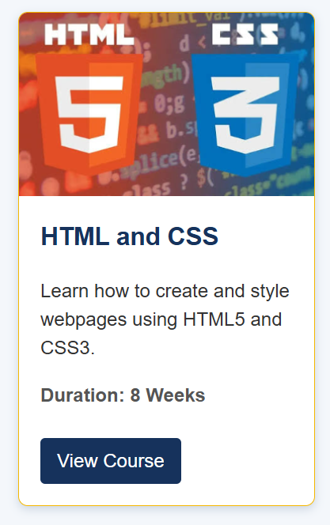
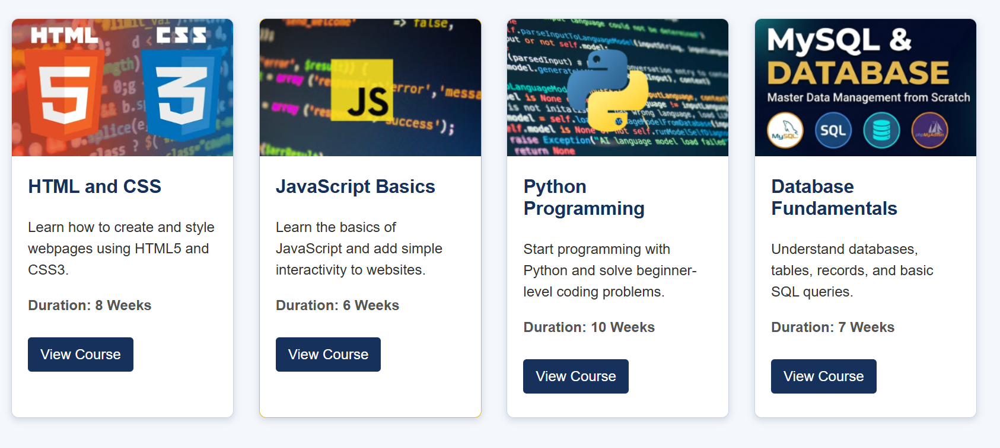
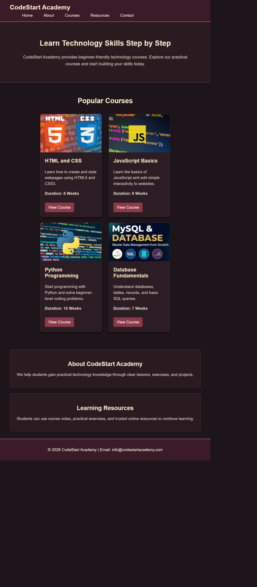

# CodeStart Academy

## Student Information

- Student Name: Yug D Dahal
- Student ID: 2602412426
- Module Name: CIS092-1 Fundamentals Of Software Engineering - Computing
- Assignment Title: Designing a Navigation Bar and Card Components Using HTML & CSS

## Project Description

This project is a basic HTML and CSS webpage for CodeStart Academy. It includes a navigation bar, a course card design, four course cards, a header section, content sections, and a footer. The project demonstrates fundamental HTML structure and CSS styling techniques.

## Technologies Used

- HTML5
- CSS3

## Learning Resources

### Bro Code — HTML & CSS Full Course

- **Resource:** Bro Code YouTube Channel  
- **Video:** [HTML & CSS Full Course for free](https://www.youtube.com/watch?v=HGTJBPNC-Gw)  
- **Topics learned:** HTML structure, CSS selectors, navigation bars, cards, the CSS box model, images, buttons, and hover effects.

## Screenshots

## Navigation Bar

## Single Card

## Multiple Cards

## Complete Website

## What I Learned

I learned how to structure a webpage using semantic HTML elements such as `header`, `main`, `section`, and `footer`. I also learned how to use CSS selectors, colors, fonts, margins, padding, borders, border radius, image properties, and hover effects. I learned that padding adds space inside an element, while margin adds space outside an element.

## Challenges and Solutions

### Challenge 1: Card images did not fit correctly

The images were not the same size and affected the appearance of the cards.

**Solution:** I used a fixed image height and `object-fit: cover` so that all images appear at a consistent size.

### Challenge 2: Navigation links did not have equal spacing

The links in the navigation bar looked too close together.

**Solution:** I used `margin-right` on each navigation list item and padding on the links to improve the spacing.

## AI Usage

I used ChatGPT just to make my README.md look much more cleaner and organized. I wrote everything and just asked AI to fix my grammatical error while making the sentence structure better.